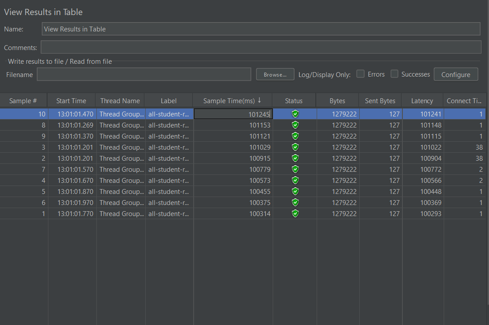
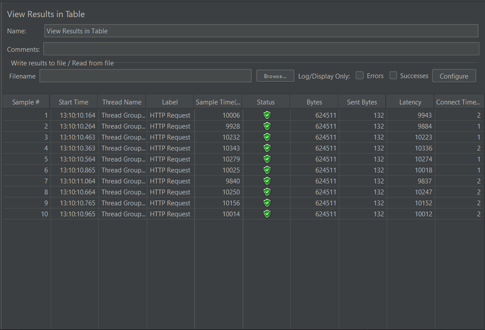
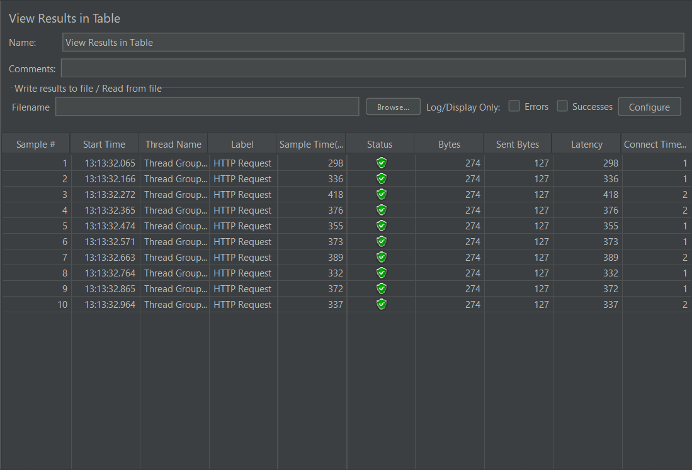
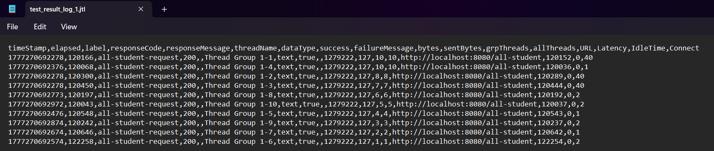
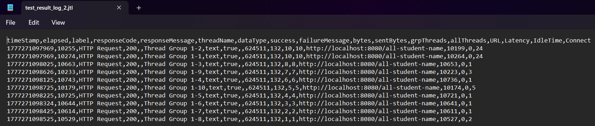
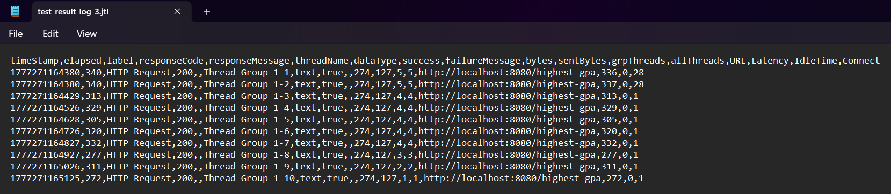
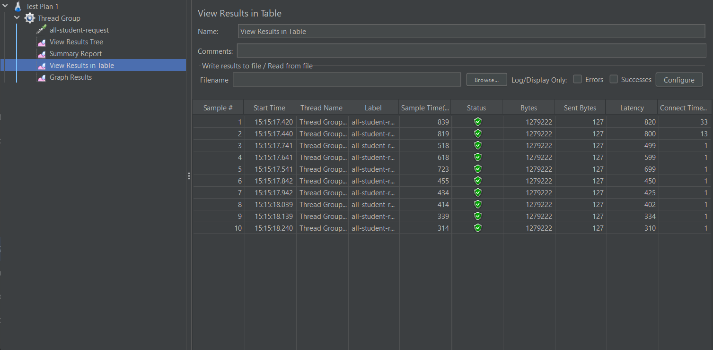
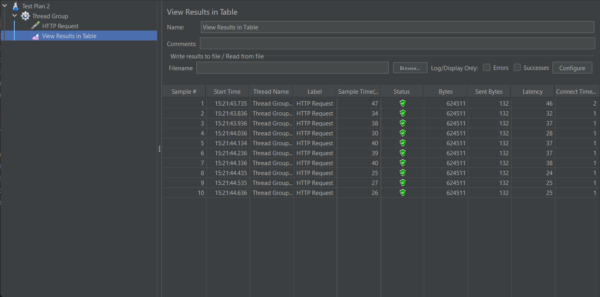
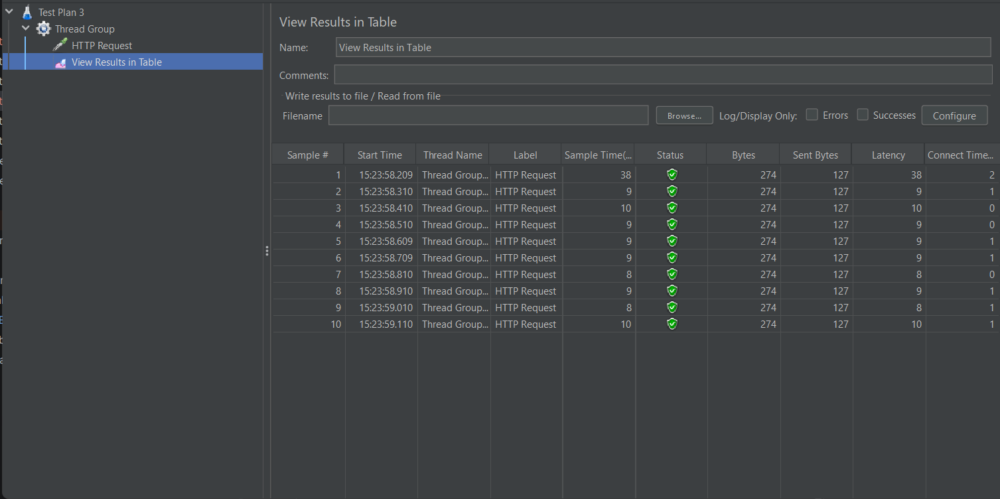

Hasil Awal GUI

## All Student JMETER GUI

---

## All Student Name JMETER GUI

---

## Highest GPA JMETER GUI

---

Hasil Awal CLI

## All Student JMETER CLI (LOG)

---

## All Student Name JMETER CLI (LOG)

---

## Highest GPA JMETER CLI (LOG)

---

Perbandingan Hasil Setelah Optimisasi

## All Student

---
### Before:

### After:

Latency dari sekitar 100000 ms menjadi 400-500 ms

## All Student Name

---
### Before:

### After:

Latency dari sekitar 10000 ms menjadi 30-40 ms

## Highest GPA

---
### Before:

### After:

Latency dari sekitar 300-400 ms menjadi 9-10 ms

---
### Kesimpulan:
Terdapat penurunan yang sangat signifikan dalam kinerja program yang dilihat dari penurunan sample time.

## Reflection

---
1. Pendekatan JMeter bersifat eksternal atau black-box. JMeter mensimulasikan beban nyata dari pengguna (misalnya ratusan request bersamaan) untuk melihat bagaimana aplikasi merespons dari luar dengan mengukur latency, throughput, dan response time. Sebaliknya, IntelliJ Profiler bersifat internal atau white-box. Profiler tidak peduli dengan jumlah pengguna secara langsung, melainkan melihat apa yang terjadi di dalam Java Virtual Machine (JVM) saat suatu atau beberapa request berjalan. Profiler melihat penggunaan CPU pada level method, alokasi memori (Heap), dan aktivitas Garbage Collector.
2. Tanpa profiling, mengoptimalkan aplikasi biasanya hanya berdasarkan tebakan. Proses profiling memberikan data pasti. Misalnya, ketika sebuah endpoint terasa lambat, Flame Graph atau data memori pada profiler bisa langsung menunjukkan bahwa aplikasi menghabiskan terlalu banyak waktu untuk memetakan ribuan objek Student dari database, atau menunjukkan adanya lonjakan aktivitas Garbage Collector akibat pembuatan objek String yang berlebihan di dalam sebuah loop. Visibilitas ini memandu saya langsung ke akar masalah tanpa harus menebak-nebak.
3. Menurut saya, IntelliJ Profiler efektif dalam membantu melihat bottelneck di kode. Integrasinya langsung dengan IDE membuat mudah digunakan saat development. Fitur yang paling membantu adalah kemampuannya mengambil method spesifik yang memakan CPU atau memori paling besar.
4. Salah satu tantangan terbesar saat melakukan performance testing adalah bagaimana menjalankan test-test yang berbeda untuk seluruh endpoint. JMETER mengatasi ini melalui opsi nya dengan menjalankan test melalui CLI. Saat Profiling, terkadang sulit untuk menginterpretasikan hasilnya. Solusinya adalah menggunaan filter dalam profiler untuk memfokuskan analasis untuk kode-kode paling impactful.
5. Manfaat terbesar dari menggunakan IntelliJ Profiler adalah efisiensi waktu dalam debugging performa dan memberikan pemahaman yang lebih mendalam tentang bagaimana kode saya dieksekusi di level memori. Profiler juga membantu saya menyadari melihat kode yang tidak optimal atau yang bisa ditingkatkan.
6. Jika JMeter menunjukkan waktu respons yang sangat lambat tetapi IntelliJ Profiler menunjukkan bahwa eksekusi metode Java sangat cepat, ini biasanya mengindikasikan masalah di luar JVM. Inkonsistensi ini umumnya disebabkan oleh bottleneck pada jaringan, waktu tunggu (latency) koneksi database, keterbatasan, atau struktur database yang belum diindeks. Di situasi ini, berarti perlu investigasi diluar dari kode seperti masalah database atau jaringan.
7. Berdasarkan temuan profiling, strategi utama yang saya terapkan adalah mendelegasikan beban kerja sebanyak mungkin ke database. Ini mencakup penggunaan Derived Query Methods di Spring Data JPA (seperti findTopByOrderBy) untuk menghindari penarikan seluruh tabel ke memori, menggunakan JOIN FETCH, menggunakan database projection (hanya menarik kolom yang dibutuhkan), dan menggunakan Java Streams untuk pengolahan string. Untuk memastikan perubahan ini tidak merusak fitur yang sudah ada, solusi terbaiknya adalah dengan menggunakan unit testing untuk mengecek apakah perubahan.

